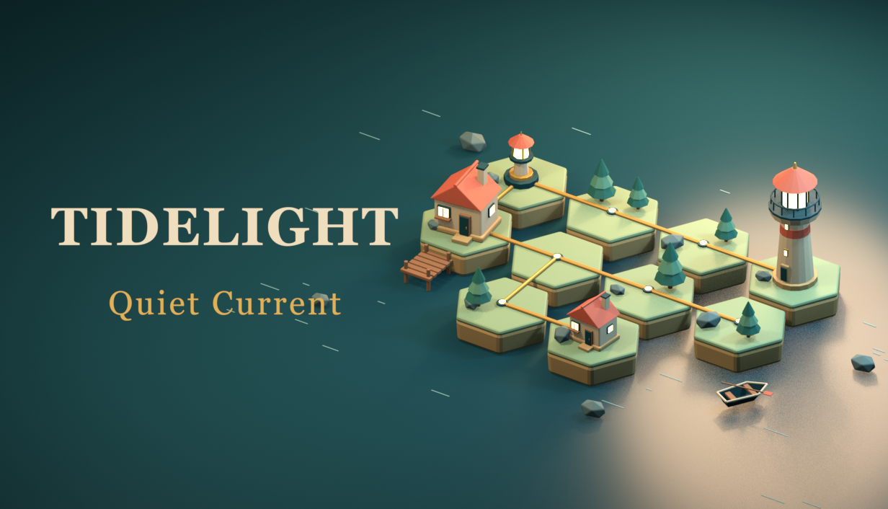
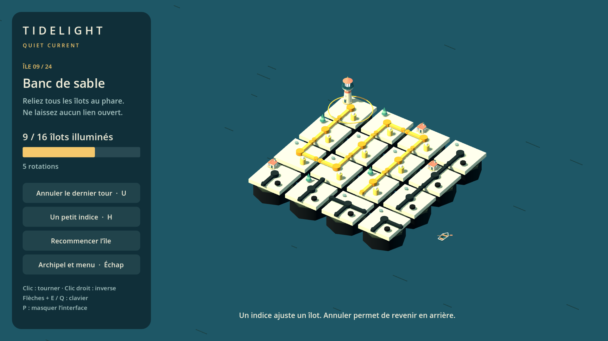

# TIDELIGHT: Quiet Current

A quiet 3D connection puzzle. Rotate the network across miniature islands, follow the golden paths, and bring every island back to light.

**[Download the free Windows demo](https://github.com/Zeldious-Studio-Company/tidelight-quiet-current/releases/latest)** · **[Player feedback](https://github.com/Zeldious-Studio-Company/tidelight-quiet-current/issues)**

The demo contains the first **four islands**. The complete game has **24 campaign puzzles and free play**. English and French, local saves, undo, hints, optional sound and reduced motion. Mouse and keyboard. Works offline.

Steam publication is being prepared. **Planned price: €4.99 / US$4.99. The game is not on sale on Steam yet.** No release date is promised.

## Play

1. Download the Windows x64 ZIP from Releases.
2. Extract the complete archive to a folder.
3. Run `Tidelight-Demo.exe`, keeping its `data_Tidelight_windows_x86_64` folder alongside it.

The .NET runtime is included; Godot does not need to be installed. Windows 10/11 x64 is the target. Tested on Windows 11 with NVIDIA RTX 5060 Ti; minimum hardware and Steam Deck compatibility have not been established. The build is unsigned.

Left click / E / Space: rotate. Right click / Q: reverse. Arrows: select. U: undo. H: hint. Esc: menu. F11: full screen. P: hide UI. An active connection is gold and has a raised beacon; the goal is to power every island with no open network ends.

## Français

Un puzzle 3D paisible pour une petite pause. Tournez les connexions, reliez les îlots au phare et regardez le courant circuler. La démo propose quatre îles gratuites ; le jeu complet compte 24 niveaux et un mode libre. Prix prévu sur Steam : **4,99 €**. La publication Steam est en préparation.

Décompressez toute l’archive, puis lancez `Tidelight-Demo.exe`. Le dossier de données doit rester à côté. Aucun compte ni connexion pour jouer. La sauvegarde locale est automatique. Langue, son et mouvements réduits se règlent dans le menu.

## Feedback and media

After playing, [open a feedback issue](https://github.com/Zeldious-Studio-Company/tidelight-quiet-current/issues/new/choose). Useful details: game version, Windows version, the island concerned, steps to reproduce a problem, and what you enjoyed or found unclear. Do not post passwords, personal details, or your entire system logs.

You may record, stream and monetize your own gameplay footage. There is no embargo and no obligation to provide a positive review. Images labelled illustrations are Blender renders; images labelled gameplay come from the running game.

## Development and rights

Made with Godot 4.5.2 .NET / C# and Blender. AI-assisted tools helped create design, code, player-facing text, and scripts for original geometry, materials and synthesized audio. No generative AI service runs during gameplay. Procedural puzzles are generated locally.

© 2026 Zeldious Studio. All rights reserved for the original game and its assets. The free demo may be redistributed unchanged and free of charge with the included notices. Godot and bundled .NET libraries retain their respective licenses. This repository distributes the demo and promotional media; it does not grant an open-source license to the full game.
